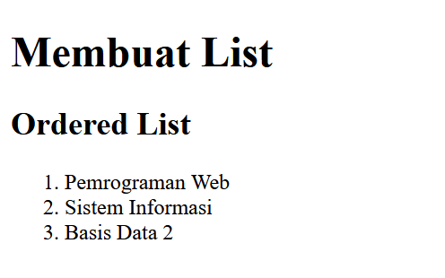
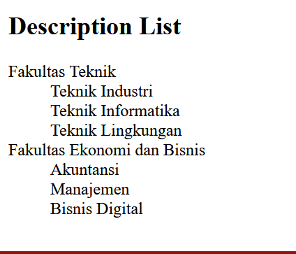
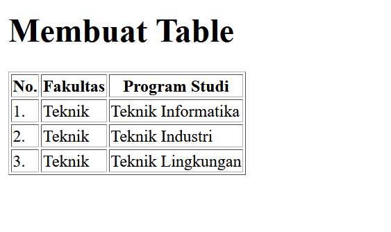

## Nama         : Muhamad Rifai Aditiya 
## Nim          : 312010065
## Kelas        : TI.20.A1
## Mata Kuliah  : Web Pemrograman

 ## Tugas Praktikum 3

 # 1. Pertama - tama kita membuka VSCode
 

 # 2 . Kemudian membuat dokumen HTML dengan nama file lab3_list.html  pada Kerangka VS Code Dan Ini Hasil Codingan yang saya buat 
 

# 3. Kemudian  menambahkan sebuah kode untuk membuat Ordered List seperti berikut. 

 
 # 4. Kemudian tambakan kode untuk membuat Unordered List, setelah deklarasi ordered list pada section unordered-list, seperti berikut Dan ini Hasil Dari Code Tersebut
 

 # 5 .Setelah itu buat file baru dengan nama lab3_tabel.html seperti berikut Dan Ini Hasil Codingan yang sudah kita input

# 6 . Untuk mengatur margin dan padding pada cel data, tambahkan atribut cellpadding dan cellspacing pada tag table dan ini hasil Dari codingan  cell pading berikut

# 7 . Langkah selanjutnya menggabungkan sel dataUntuk menggabungkan sel data, gunakan atribut rowspan dan colspan. Atribut rowspan untuk menggabungkan baris (secara vertikal) dan colspan untuk menggabungkan kolom (secara horizontal)

# 7 .Kemudian membuat file baru dengan nama lab3_form.html seperti berikut.  
 

 ## TERIMKASIH SEMUA
